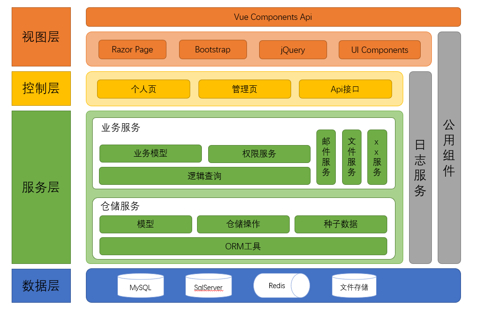

# Jeremy.IdentityCenter

一套完整的基于 IdentityServer4 的认证中心。

[English](./README_en.md)

## Demo

[Demo](https://idc.xiaopangying.com)

## 功能

它非常适合学习入手，因为它：

- 基于 .NET5
- 支持多种数据库
- 灵活的配置模式
- 完整的后台界面
- 自定义页面组件

## 架构图

## 使用方法

下载整个库文件，直接启动即可。当然，最好先配置一下，因为有一些内容需要自定义，仅仅是很少的一部分。

### 启动前配置

只需要检查并配置 `Jeremy.IdentityCenter` 中的 `appsettings.json` 文件即可。

#### 配置数据库

在 `ConnectionStrings` 字段中配置对应的数据库连接字符串，然后在 `DatabaseProvider.Type` 中提供对应的数据库 KEY 值即可。

> 如果文件齐全，默认可以正常启动。但仍然建议在运行前阅读 `database/Jeremy.IdentityCenter.Database/Ensure/DbMigrations.cs` 中的 `运行前须知（L45）`，以明确数据库配置规则。

默认配置了 `MySQL` 和 `SQLServer`，如需其他数据库可以自行添加或者待我更新。

#### 配置账户设置

按需求配置 `Confirm`，`Token`，`Authentication` 的相关内容即可。具体内容可以参考文件中对应的注释说明。

#### 配置邮件系统

配置 `Email`，默认启用，需要配置参数。因为所有验证基本都需要使用邮箱服务，所以尽量启用，如果不需要，请自行修改代码。

## 特别说明

该库仅供学习使用。
