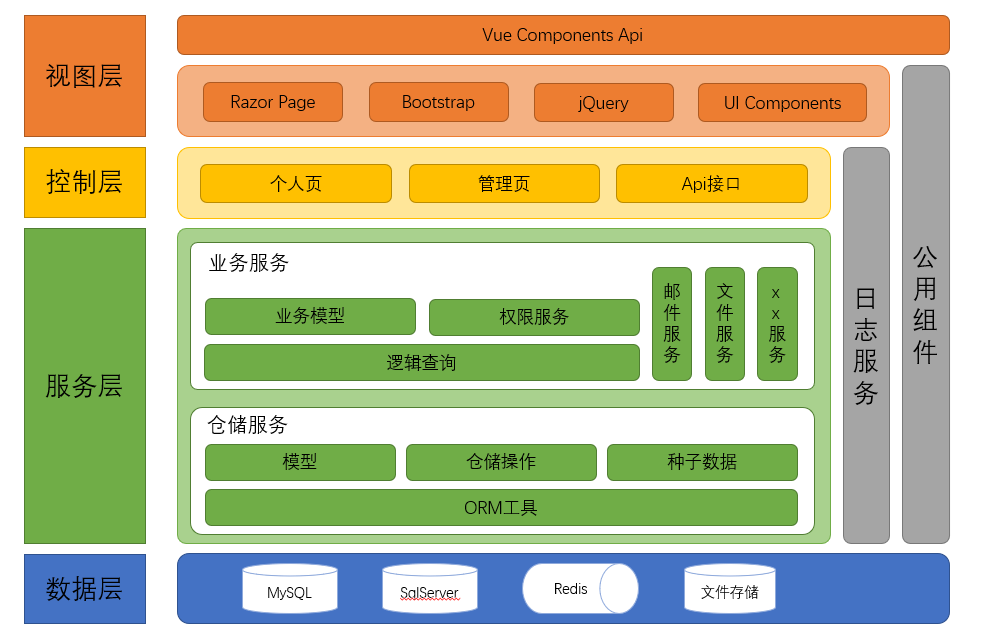

# Jeremy.IdentityCenter

A complete set of `IdentityServer4` based authentication center.

[中文](./README.md)

## Features

It is very suitable for learning to start because it:

- Based on .NET5
- Support multiple databases
- Flexible configuration mode
- Complete admin page
- Custom page components

## Architecture diagram

## Usage

Download the entire library file and launch it directly.Of course, it's best to configure it first, because there are some things that need to be customized, just a few of them.

### Prestartup configuration

Just check and configure the `appsettings.json` in `Jeremy.IdentityCenter`.

#### Configure database

Configure the corresponding database connection string in the `ConnectionStrings` field, and then provide the corresponding database KEY in the `DatabaseProvider.type`.

> If the file is complete, it can be started by default.But still suggest reading the guidelines in `database/Jeremy.IdentityCenter.Database/Ensure/DbMigrations.cs`(L45) before running, in order to make clear the database configuration rules.

Configured `MySQL` and `SQLServer` by default. If you need other databases can be added or I update.

#### Configure account

Configure the relevant content of `Confirm`, `Token` and `Authentication` as required. For details, please refer to the corresponding notes in the document.

#### Configuring Email

Configure `Email`, enabled by default, requires configuration parameters. Because all validations basically require the use of the mailbox service, so try to enable it, if not, please modify the code.

## Special

This library is for learning use only.
